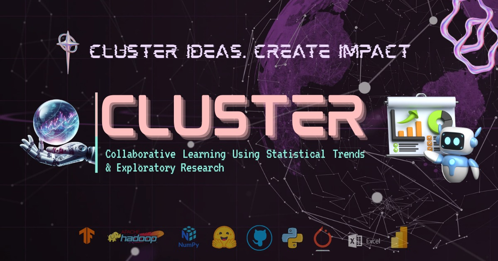

<p align="center">
  
</p>

<h1 align="center">🌐 CLUSTER: Data Science Club Portal</h1>

<p align="center">
  Your gateway to collaborative data science learning, contribution, and innovation.
</p>

<p align="center">
  <a href="https://github.com/CLUSTER-DS-Club/cluster/stargazers">
    
  </a>
  <a href="https://github.com/CLUSTER-DS-Club/cluster/network/members">
    
  </a>
  <a href="https://github.com/CLUSTER-DS-Club/cluster/issues">
    
  </a>
  <a href="https://github.com/CLUSTER-DS-Club/cluster/pulls">
    
  </a>
  <a href="https://github.com/CLUSTER-DS-Club/cluster/graphs/contributors">
    
  </a>
  
  
  
  
</p>

---

## 📚 What is CLUSTER?

> **CLUSTER** is the official platform of the **CLUSTER Data Science Club** that empowers students to collaborate, learn, and contribute to real-world data science and AI projects.

We focus on:

- 📊 Data Analysis & Visualization  
- 🤖 Machine Learning Projects  
- 🧠 Natural Language Processing  
- 👁️‍🗨️ Computer Vision  
- 🧪 MLOps, Deployment, and more...

---

## 🚀 Getting Started

### 🧰 Prerequisites
cd 
- [Node.js](https://nodejs.org/) ≥ 18
- npm or yarn

### 🧪 Installation

```bash
git clone https://github.com/CLUSTER-DS-Club/cluster.git
cd cluster
npm install
npm run dev
